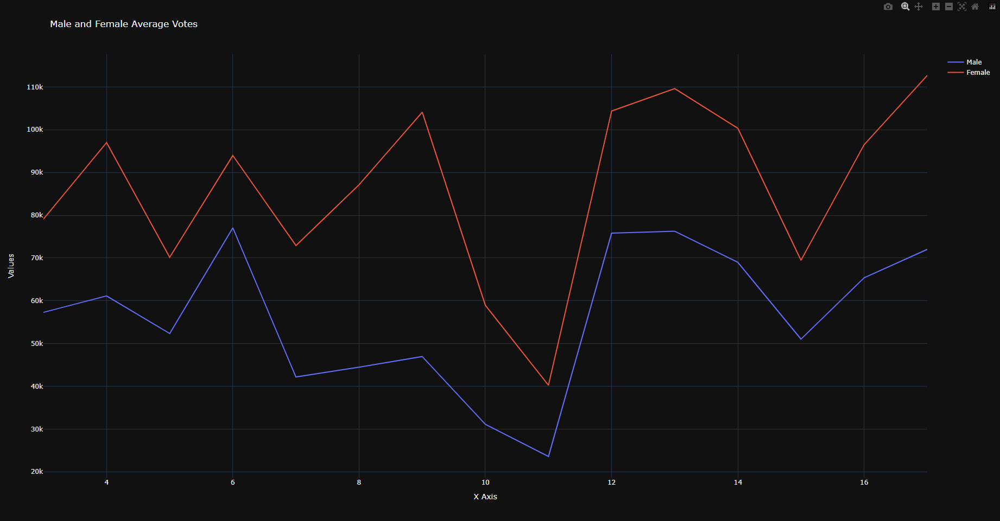

# Output Directory Structure

```
│
└───output
    ├───genderDomination
    ├───IncumbencyAnalysis
    └───notaAnalysis
```

## Requirements

The required libraries have been listed in the `requirements.txt` file. To install them, run the following command in your terminal:

```
pip install -r requirements.txt
```

Note that some libraries may require manually installing their dependencies.
The requirements will also be listed here:

```
pandas
scikit-learn
matplotlib
tqdm
plotly
selenium
undetected-chromedriver
pyperclip
webdriver-manager
kaleido
nbformat
matplotlib
```

## Introduction

Welcome to the Indian Elections Analysis project. This is an exhaustive research study examining various aspects of the Indian electoral process. The purpose of this initiative is to cast light on patterns and behaviours manifested by electors, candidates, and political parties across the nation, which may have substantial implications for the democratic process.

Running the codebase is fairly simple. The project is divided into two parts - Analysis and Classification. The Analysis part is further divided into five subparts, each of which is contained in a Jupyter notebook. The Classification part is also contained in a Jupyter notebook. The code for each of these notebooks is self-contained and can be run independently by just clicking `Run All` in any jupyter client. Note that analysis involving randomization may produce slightly different results each time it is run and may differ from the results presented in this document.

The analysis of the paper is in a separate README file in the `PaperReading` directory. Everything else is in this README file.

## Analysis

This study consists of five distinct analyses:

1. **Gender-Based Voting Analysis**: This analysis investigates how much each state's voting patterns are influenced by gender. It explores which gender receives more votes and whether there are any discernible trends that can explain these patterns. `GenderAnalysis.ipynb` contains the code for this analysis.

2. **Incumbent Party Success Analysis**: This section looks into how often each state re-elects the incumbent party. It offers insights into the conditions that favor the re-election of ruling parties, providing a comprehensive understanding of voter behavior towards political continuity. `IncumbencyAnalysis.ipynb` contains the code for this analysis.

3. **NOTA (None of the Above) Analysis**: Here, we study the prevalence and distribution of NOTA votes across different states. This analysis will provide insights into voter dissatisfaction with the available candidate options and potential electoral apathy. `NotaAnalysis.ipynb` contains the code for this analysis.

4. **Binary Literacy Analysis**: This analysis investigates the proportion of literate versus illiterate candidates in each state's elections. The aim is to provide an overview of the literacy levels among the candidate pool, providing insights into the educational background of our potential leaders. `Literacy_Analysis.ipynb` contains the code for this analysis.

5. **Scaled Literacy Analysis**: Building on the binary literacy analysis, this study further categorizes the candidates into more detailed literacy levels such as 'Illiterate', '8th pass', 'Graduate', and more. This allows us to understand the distribution of candidates' educational qualifications in each state, presenting a clearer picture of the educational diversity among candidates. `Literacy_Analysis.ipynb` contains the code for this analysis.

In the 'output' directory, you'll find three subdirectories - 'genderDomination', 'IncumbencyAnalysis', and 'notaAnalysis'. Each of these directories contains two types of files:

Text Files (.txt): These files contain the raw data used to create the heatmaps. They represent the data in a structured, text-based format that can be easily read and processed by various programs.

Image Files (.png): These are the heatmaps generated from the text files. They provide a visual representation of the data, making it easier to identify patterns and trends.

## Insights

While data has been provided for all elections, the analysis will primarily focus on insights drawn from the 2019 and 2014 elections for the sake of brevity apart from incumbency since this feature requires a range of elections to be considered.

### Gender-Based Voting Analysis

Before we move onto gender domination, I present a graph that represents average number of votes received by females and males. Note that though male records are around 80k, female records are around 4k.


In this plot, we observe an intriguing trend in the Indian political landscape: women candidates consistently receive more votes on average across the nation. This indicates a significant shift in voter behavior, reflecting an increasing acceptance and support for women in politics. This trend could be a result of various factors, including growing awareness about gender equality, women empowerment initiatives, successful female leadership examples, and targeted policy initiatives catering to women.

1. **Preference for Male Candidates**:

   In 2014, several regions showed a significant preference for male candidates. This preference was most notable in 'Daman & Diu', 'Lakshadweep', 'Arunachal Pradesh', 'Mizoram', and 'Nagaland' - all scoring a perfect 10. Other regions such as 'Dadra & Nagar Haveli', 'Goa', 'Manipur', 'Meghalaya', 'Puducherry', and 'Tripura' also exhibited a strong preference for male candidates. This could have been due to traditional social norms that favored male leadership or the dominance of male candidates on the ballot.

   By 2019, regions such as 'Arunachal Pradesh' shifted from a strong male preference to a relatively balanced gender preference, potentially due to growing awareness and promotion of gender equality. Conversely, 'Jammu & Kashmir' transitioned from a male preference in 2014 to a female preference in 2019, possibly as a result of successful female candidates or targeted campaigns to increase female representation.

2. **Balanced Voting**:

   In 2014, several regions such as 'Bihar', 'Delhi', 'Karnataka', 'Maharashtra', 'Rajasthan', 'Tamil Nadu', 'Uttar Pradesh', and 'Uttarakhand' showed balanced voting patterns. This suggests that voters in these regions might have been more focused on candidates' policies or party affiliations rather than their gender.

   By 2019, some of these regions such as 'Bihar' and 'Delhi' demonstrated a shift towards a preference for female candidates. This change might be attributed to successful efforts to promote women's political participation, changing societal attitudes towards female leaders, or an increase in the number of compelling female candidates.

3. **Preference for Female Candidates**:

   In 2014, no specific region showed a pronounced preference for female candidates.

   However, by 2019, 'Chandigarh', 'Tripura', 'Dadra & Nagar Haveli and Daman & Diu', and 'West Bengal' had developed a strong preference for female candidates. Regions such as 'Chandigarh' and 'Uttarakhand' also exhibited significant shifts towards female preference compared to 2014. These changes might be due to effective advocacy for female representation, changes in societal attitudes towards female leadership, or the influence of successful female politicians.

   These patterns indicate that gender preferences in India's electoral politics are dynamic and can change significantly over a relatively short period. Understanding these trends and the factors that influence them is crucial for promoting gender equity in political representation.

### NOTA Analysis

1. **Increase in NOTA vote share**:

   Several regions like 'Andhra Pradesh', 'Bihar', 'Chandigarh', 'Chhattisgarh', 'Dadra & Nagar Haveli', 'Daman & Diu', 'Goa', 'Gujarat', 'Himachal Pradesh', 'Jharkhand', 'Odisha', 'Punjab', 'Tamil Nadu', 'Uttarakhand', and 'Uttar Pradesh' experienced an increase in NOTA vote share from 2014 to 2019. This could be attributed to voters' dissatisfaction with the available candidates or political parties, or increasing awareness about the NOTA option since it was introduced in 2009. It could also be due to caste-based bias to prevent a different caste from entering the region. I wanted to analyze the candidate caste data where NOTA was highly used but it was not available for more than 60k out of 90k records which is a significant portion of the data.

   Though it is difficult to find specific reasons for all the states, for Andhra Pradesh maybe [this article](https://timesofindia.indiatimes.com/city/visakhapatnam/araku-in-visakhapatnam-district-second-in-nota-votes-in-the-country-in-2019-elections/articleshow/83767012.cms) can provide some insight. The Araku parliamentary constituency in Visakhapatnam district stood second in the country in terms of the number of NOTA votes polled in 2019 general elections. The low literacy rate among the tribal population and lack of awareness over usage of electronic voting machines may have contributed to the higher number of NOTA votes. Some voters might have also been pressing the wrong button due to lack of knowledge over the working mechanism of EVMs. Similar cases might have happened in other constituencies too and might have gone unnoticed.

2. **Decrease in NOTA vote share**:

   A few regions like 'Arunachal Pradesh', 'Assam', 'Karnataka', 'Lakshadweep', 'Meghalaya', 'Mizoram', 'Nagaland', 'Sikkim', and 'Tripura' saw a decrease in NOTA vote share from 2014 to 2019. This may suggest that voters in these regions were more satisfied with the candidates or parties available in 2019 as compared to 2014 or were less aware or less inclined to use the NOTA option in 2019.

3. **Negligible change in NOTA vote share**:

   Regions like 'Delhi', 'Haryana', 'Madhya Pradesh', and 'Maharashtra' showed minimal changes in NOTA vote share between 2014 and 2019.

In summary, NOTA vote shares exhibit regional variations and changes over time, reflecting the evolving political climate, voter awareness, and satisfaction levels. This is a critical aspect of electoral analysis, providing insights into voter behavior beyond the choices of specific candidates or parties.

### Incumbency Analysis

The incumbency rates for different regions of India, analyzed across all elections and the last five elections, illustrate a compelling landscape of electoral dynamics.

#### All Elections

On the higher end of the incumbency spectrum, regions like Lakshadweep (71.43%) and A & N Islands (57.14%) show a marked preference for retaining their incumbents, suggesting strong voter loyalty or satisfaction with the status quo. In contrast, areas like Jammu & Kashmir (28.21%) have demonstrated a proclivity towards electing new candidates over incumbents, hinting at possible dissatisfaction with existing leadership or a desire for change. It be a reflection of the volatile political climate and the desire for change among the electorate especially due to the ongoing conflict in the Northern borders.

In the middle of the spectrum, states like West Bengal (49.52%), Goa (38.89%), and Uttarakhand (40%) suggest a more balanced or cyclical political landscape where incumbents and newcomers both have reasonable chances of success.

#### Last 5 Elections

Comparatively, in the last five elections, Lakshadweep has seen a decrease in its incumbency rate to 40%, indicating a potential shift in voter sentiment. Similarly, Jammu & Kashmir maintains its low incumbency rate at 30%, underscoring a consistent trend of favoring fresh faces in political positions.

However, certain regions have shown a substantial rise in incumbency rates over the last five elections. For instance, Goa's incumbency rate increased to 50%, suggesting growing support for incumbent leaders. Other states like Gujarat (52.31%) and Maharashtra (45%) also showcase an upward trend in their incumbency rates. For Gujarat, it could be possible that this incumbency is due to high economic growth plus having a central leader from the state [1](https://www.ncbi.nlm.nih.gov/pmc/articles/PMC7938696/) [2](https://www.csis.org/analysis/energy-transition-strategies-gujarats-low-carbon-development-pathway).
Conversely, Tamil Nadu's incumbency rate has dwindled to 21.03% in the recent elections, indicating a stronger inclination towards new leaders.

#### Change in incumbency factor (Devansh Manu):

In fact if we just talk about the 2019 Elections, [this thesis](https://cdn.iiit.ac.in/cdn/precog.iiit.ac.in/Publications_files/DevanshManu_Thesis_Elections2019.pdf) pg 49-50 sheds light on the fact that in 2019 incumbency turned even higher. The thesis notes that incumbency has indeed proven to be a distinguishing factor in the 2014 and 2019 Indian general elections. In 2014, the elections were marked by a robust anti-incumbency sentiment against the governing Congress party, with allegations of corruption and soaring inflation rates fueling public dissatisfaction. Conversely, the 2019 elections demonstrated strong pro-incumbency favor towards the then-ruling Narendra Modi government.

The thesis also notes that this pattern of incumbency preference has been evident in the country since 1998. For instance, Atal Bihari Vajpayee from the BJP served two terms, initially from March 1998 to October 1999, and then from October 1999 to May 2004. Subsequently, Manmohan Singh from the INC held the office for two terms, from May 2004 to May 2009, and from May 2009 to May 2014. Lastly, Narendra Modi has been in power for two consecutive terms, starting from May 2014 to May 2019, and from May 2019 onwards.

#### Comparative Analysis

Comparing the overall data with the data from the last five elections, a nuanced picture of changing political dynamics emerges. Some regions have demonstrated shifts in their voting patterns, either favoring new leadership over incumbency, as seen in Lakshadweep, or showing increased support for incumbents, as in the case of Goa.

In some areas, voting patterns appear to have remained relatively stable across all elections and the last five, such as Jammu & Kashmir, with consistently low incumbency rates, and West Bengal, with nearly unchanged rates.

### Literacy Analysis

Analyzing the education level of the representatives in each state can provide some insight into the education landscape and its potential influence on politics.

#### Binary Analysis

In the binary analysis, a score of 1 was given to any representative who is not illiterate, while a score of 0 was given to those who are illiterate. In this analysis, Nagaland, Sikkim, and Lakshadweep scored 100, indicating that all representatives from these states are literate.

There's a high literacy rate among representatives across the board, with even the lowest scoring state (Telangana - 32%) having a significant proportion of literate representatives. This suggests a general trend of literacy among political representatives.

#### Scaled Analysis

The scaled analysis, on the other hand, provided more granularity by assigning different scores for different education levels (from "Illiterate" to "Doctorate"). Here, the states of Nagaland and Manipur scored exceptionally high, with rates of 100 and 99.63, respectively, suggesting a high proportion of representatives with advanced degrees in these regions. In contrast, states like Daman & Diu and Gujarat had lower scores, hinting at a lower proportion of highly-educated representatives.

Interestingly, when comparing the binary and scaled analysis, some states like Nagaland and Sikkim scored high on both, suggesting that not only are their representatives literate, they also tend to have advanced degrees.

On the other hand, some states such as Telangana have a high literacy rate in the binary analysis (indicating most representatives are literate) but score significantly lower in the scaled analysis. This could imply that while the majority of representatives are literate, they may not have advanced education.

#### Comparative Analysis

When comparing the binary and scaled analyses, we can draw a few conclusions:

1. **High Literacy & High Education**: States such as Nagaland, Sikkim, and Manipur score high in both analyses, indicating a high level of both literacy and advanced education among their representatives.

2. **High Literacy & Varied Education**: States like Uttar Pradesh and Gujarat, despite having a high literacy rate, show a more significant variance in their education levels. This could potentially signify that while literacy is widespread, access to advanced education may be more inconsistent.

3. **Varied Literacy & Education**: Some states, like Telangana, score low in both analyses, indicating lower levels of literacy and advanced education among their representatives.

The data highlights the diversity of the educational landscape across the states of India, with variations in both literacy and education levels among political representatives. However, this analysis does not provide insight into the reasons for these variations, which could be influenced by various factors, including state education policies, economic conditions, cultural factors, and more.

# Classification Analysis

This project also includes a classification task, conducted in the Jupyter notebook named `classification.ipynb`. In this task, we aim to predict whether a candidate is a 'Turncoat', meaning they have switched parties. In the ever-evolving landscape of politics, party loyalty is an intriguing aspect to study. Candidates switching their allegiances, known as 'Turncoats', often pose intriguing questions regarding political behavior and strategy. This analysis aims to unravel the factors that might influence such decisions, thus providing a deeper understanding of the political dynamics at play.

The features used in this classification task are as follows:

- `State_Name`: The name of the state where the election is held.
- `Party`: The political party to which the candidate belongs.
- `No_Terms`: The number of terms the candidate has served previously.

These features were selected as a subset of the original data based on rigorous feature selection procedures, to ensure that our model focuses on the most relevant information.

By predicting 'Turncoat' status based on these features, this classification task helps to shed light on the patterns and behaviors that may influence a candidate's likelihood to switch parties.

The results of this classification task are stored in the notebook itself and presented down below, and the code for the task is also included in the notebook. Please note that the results below are a snapshot of the results obtained from one run of the code. Due to the random nature of some of the algorithms, the results may vary slightly each time the code is run which may also change the current results being shown in the notebook.

| Model               | Accuracy | Precision (Class 0) | Recall (Class 0) | F1-score (Class 0) | Precision (Class 1) | Recall (Class 1) | F1-score (Class 1) |
| ------------------- | -------- | ------------------- | ---------------- | ------------------ | ------------------- | ---------------- | ------------------ |
| Logistic Regression | 0.751    | 0.70                | 0.88             | 0.78               | 0.84                | 0.62             | 0.71               |
| Decision Tree       | 0.791    | 0.80                | 0.78             | 0.79               | 0.79                | 0.80             | 0.79               |
| Random Forest       | 0.797    | 0.82                | 0.76             | 0.79               | 0.78                | 0.84             | 0.80               |
| Gradient Boosting   | 0.804    | 0.85                | 0.73             | 0.79               | 0.77                | 0.88             | 0.82               |
| SVM                 | 0.634    | 0.60                | 0.77             | 0.68               | 0.68                | 0.50             | 0.58               |
| KNN                 | 0.787    | 0.82                | 0.74             | 0.78               | 0.76                | 0.84             | 0.80               |
| Naive Bayes         | 0.667    | 0.62                | 0.88             | 0.72               | 0.79                | 0.46             | 0.58               |

The difference in accuracy among these models is attributed to the nature of the algorithms themselves, the hyperparameters used, and how well these algorithms fit the specific characteristics of the data. Let's take a deeper look:

1. **Logistic Regression (0.751 Accuracy)**: This model performs reasonably well, possibly because the relationship between the independent and dependent variables could be logit (can be modeled as a logistic regression). However, since logistic regression is a linear model, it may not capture more complex relationships in the data as effectively as other models.

2. **Decision Tree (0.791 Accuracy)**: The decision tree performs better than logistic regression because it can handle non-linear relationships. This model creates a tree-like model of decisions, which can better capture more complex patterns in the data.

3. **Random Forest (0.797 Accuracy)**: Random Forest performs slightly better than the Decision Tree. It is an ensemble method that constructs multiple decision trees and aggregates their results. This method reduces overfitting associated with individual decision trees and increases generalizability, which may account for its improved accuracy.

4. **Gradient Boosting (0.804 Accuracy)**: Gradient Boosting is also an ensemble model, but it builds trees in a sequential manner, where each new tree tries to correct the errors made by the previous one. This incremental approach often results in strong performance, as reflected by its highest accuracy.

5. **SVM (0.634 Accuracy)**: The lower accuracy of the SVM model might be due to the the distribution and complexity of the data which can significantly influence the SVM's performance. Though its difficult to pinpoint the exact reason, it is possible that the data is not linearly separable, which could explain the lower accuracy.

6. **KNN (0.787 Accuracy)**: K-Nearest Neighbors performs reasonably well, likely due to its non-parametric nature, allowing it to make fewer assumptions about the data's structure and capture complex patterns.

7. **Naive Bayes (0.667 Accuracy)**: The lower accuracy of Naive Bayes may be due to its fundamental assumption of feature independence, which is rarely true in real-life data. If some features are correlated, this model's performance might degrade.

### Feature Importance

Feature importances have also been calculated for `Decision Tree`, `Random Forest`, `Gradient Boosting` and `Logistic Regression` models and are shown in the notebook. Though we will only consider the importance results from the `Gradient Boosting` model for the sake of brevity and because it has the highest accuracy, the results from other models are also included in the notebook.

| Feature    | Importance Score |
| ---------- | ---------------- |
| Party      | 0.481            |
| No_Terms   | 0.500            |
| State_Name | 0.019            |

Based on the high accuracy of the models trained in this analysis, we can confidently state that the selected features - `State_Name`, `Party`, and `No_Terms` - appear to have significant predictive power when it comes to determining a candidate's likelihood of switching parties.

`State_Name` plays a crucial role, potentially reflecting regional influences, cultural differences, or state-specific political dynamics that may affect a candidate's party affiliation. The low importance score of 0.019 for State_Name suggests that 'turncoat' behavior is more influenced by factors like party affiliation and the number of terms served.

`Party` can also be a decisive factor. It is plausible that the candidate's alignment with party ideologies, the party's popularity, or its stance on specific issues can influence their decision to remain or switch. It had a feature importance score of 0.481, indicating it played a significant role in the model's predictions. For instance, a candidate might switch parties if they believe another party is more popular among their constituents, or if they feel their personal beliefs are no longer aligned with their original party due to significant changes in party's policies or leadership.

`No_Terms` is particularly noteworthy, given its positive correlation of 0.211 with the 'Turncoat' status and an importance score of 0.5 for predicting the same. This indicates that as the number of terms a candidate has served increases, so does the likelihood of them switching parties. This could suggest that candidates with more terms might be exploring new strategies for political success, and switching parties could be one such strategy. It could also indicate that experienced politicians are more confident in their ability to retain their voter base despite a party switch.

This analysis provides a data-driven foundation for understanding the phenomenon of party switching. It could be an instrumental tool for political parties to anticipate and strategize for such events. Further, by improving our understanding of political behavior, these insights can also contribute to a more informed and engaged electorate.
